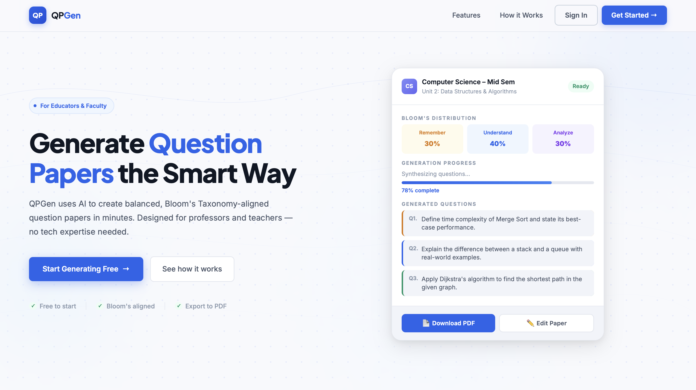
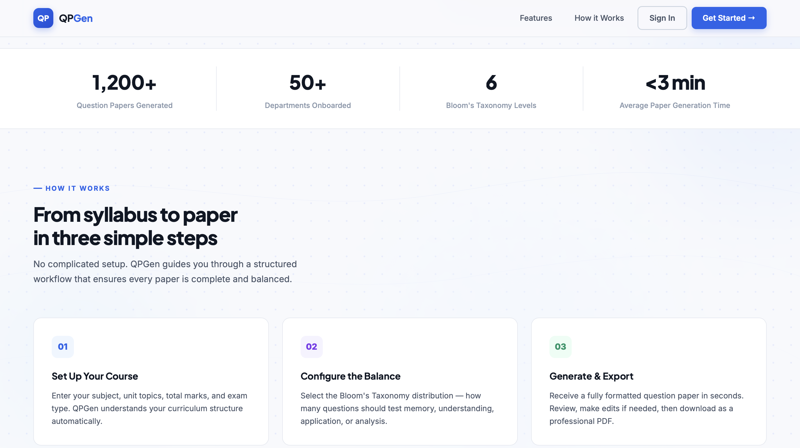
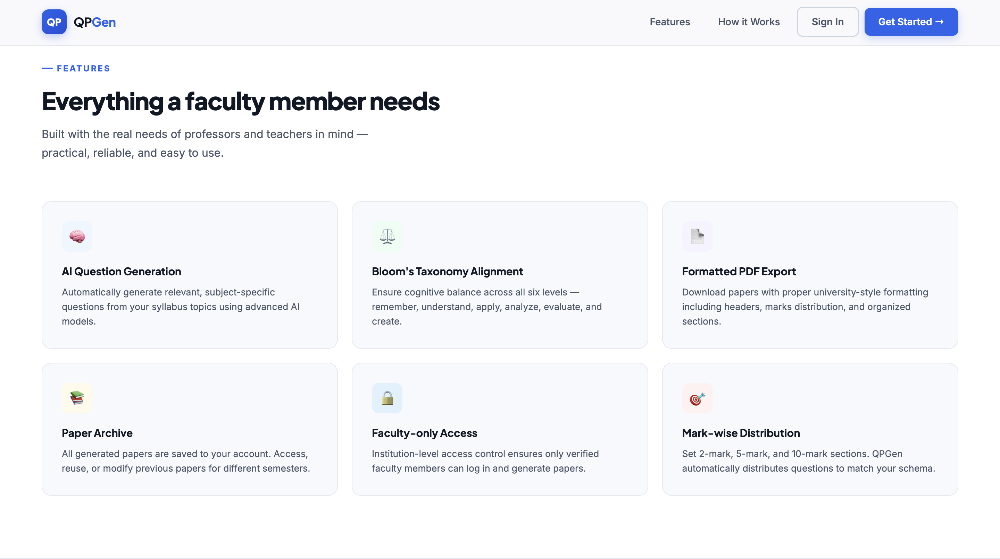
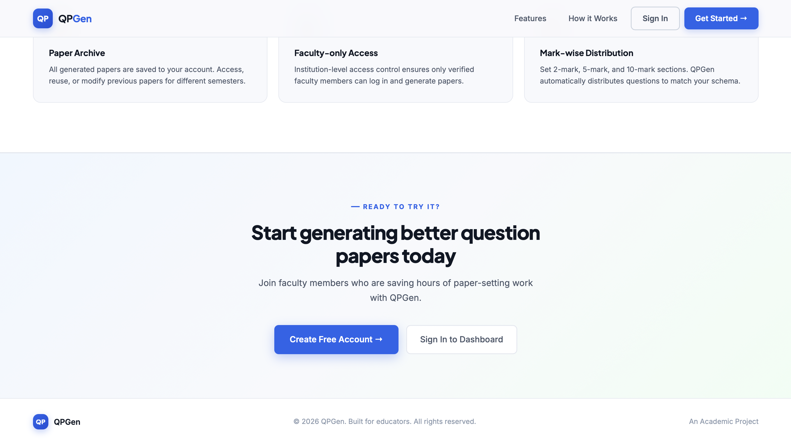

# QPGen — Smart Question Paper Generator

**QPGen** is a modern, AI-powered question bank and paper generation studio designed for educators to easily manage their question repositories and generate balanced exam papers based on Bloom's Taxonomy.

<p align="center">
  
  <br>
  
  <br>
  
  <br>
  
</p>

## ✨ Core Features

- **Dynamic Question Bank**: Categorize questions by Subject, Bloom's Level (Remember, Understand, Apply, Analyze, Evaluate, Create), and Difficulty.
- **AI Question Generation**: Automatically generate new questions using Google Gemini AI, tailored to your subject, difficulty, and Bloom's level.
  - **Auto-Retry & Validation**: Built-in 3-attempt validation loop ensures AI always returns correctly structured, non-empty JSON.
  - **Dynamic Temperature Control**: AI creativity maps to target difficulty (Easy=0.3, Medium=0.5, Hard=0.8).
  - **Robust Error Handling**: Structured error bubbling if generation constraints fail.
- **AI Paper Generation**: Generate comprehensive exam papers by specifying distributions for Bloom's levels and difficulty levels.
- **Advanced Dashboard**: Real-time statistics on question availability, subjects, and cognitive domain distribution.
- **Premium UI**: Sleek, dark-mode professional interface with smooth micro-animations and responsive design.
- **JWT Authentication**: Secure teacher/admin sessions with auto-redirect on expiry.

## 🛠 Tech Stack

- **Backend**: Python / Flask Serverless (Vercel ready)
- **Database**: PostgreSQL via Supabase (Production) / SQLite (Local) with SQLAlchemy ORM
- **Authentication**: JWT (Flask-JWT-Extended)
- **Frontend**: Vanilla HTML5, CSS3 (Custom Design System), JavaScript (Modern ES6+)

## 🚀 Getting Started

### Prerequisites
- Python 3.8+
- Node.js (Optional, for Live Server)

### Backend Setup
1. Navigate to the backend directory:
   ```bash
   cd backend
   ```
2. Create and activate a virtual environment:
   ```bash
   python -m venv venv
   source venv/bin/activate  # On Windows: venv\Scripts\activate
   ```
3. Install dependencies:
   ```bash
   pip install -r requirements.txt
   ```
4. Configure Environment Variables:
   Create a `.env` file in the `backend` directory and add your Gemini API Key:
   ```env
   GOOGLE_API_KEY=your_gemini_api_key_here
   ```
5. Run the seed script to populate the database (Initial setup only):
   ```bash
   python seed_questions.py
   ```
6. Start the Flask server:
   ```bash
   python run.py
   ```
   *The API will be available at `http://127.0.0.1:5000/api`*

### Frontend Setup
Simply open `frontend/index.html` in your browser. For the best experience, use a static server like VS Code Live Server (runs on port 5500 by default).

## 📂 Project Structure

```text
├── backend/
│   ├── app/                # Flask application logic
│   │   ├── models/         # SQLAlchemy models
│   │   ├── routes/         # Blueprints for Admin, Auth, Papers, Questions, Subjects, Teacher
│   │   └── services/       # AI Generation & Core logic
│   ├── run.py              # Entry point
│   └── seed_questions.py   # Database initializer
└── frontend/               # Static web assets
    ├── admin/              # Admin Panel interface
    ├── index.html          # Login / Landing
    ├── dashboard.html      # Stats & Overview
    ├── profile.html        # User Profile Management
    ├── questions.html      # Question Management
    ├── generate.html       # AI Paper Generation
    └── edit-paper.html     # Interactive Paper Editor
```

## 🔐 Credentials
Auto-seeded on first run against an empty database:
- **Admin**: `admin@qpgen.com` / `admin123` (or `ADMIN_DEFAULT_PASSWORD` if set in `.env`)

Register a new account via `/api/auth/register` to get a `teacher` role.

---
*Developed as a Semester 6 Minor Project.*
